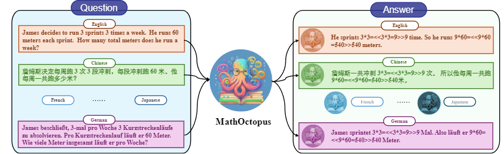

# Overview

This repository contains resources for accessing the official benchmarks, codes, and checkpoints of the paper: "[**Breaking Language Barriers in Multilingual Mathematical Reasoning: Insights and Observations**](https://arxiv.org/abs/2310.20246)".


This work pioneers exploring and building powerful  Multilingual Math Reasoning (xMR) LLMs. To accomplish this, we make the following works:

- **MGSM8KInstruct**,  the first multilingual math reasoning instruction dataset,  encompassing ten distinct languages, thus addressing the issue of training data scarcity in xMR tasks.
- **MSVAMP**, an out-of-domain xMR test dataset, to conduct a more exhaustive and comprehensive evaluation of the model’s multilingual mathematical capabilities.
- **MathOctopus**, our effective Multilingual Math Reasoning  LLMs,  training with  different strategies, which notably outperform conventional open-source LLMs and exhibit superiority over ChatGPT in few-shot scenarios.


### News

- [2024/01]  🔥 🔥 We add Mistral LLM  as our backbone, which achieves the SOTA results among open-source LLMs in Multilingual Math Reasoning, which achieves about **50.2** and **43.9** on MGSM and MSVAMP.


# 🐙🐙**MathOctopus** 🐙🐙
This repo contains the code, data, and models for "[**Breaking Language Barriers in Multilingual Mathematical Reasoning: Insights and Observations**](https://arxiv.org/abs/2310.20246)"

<div align="center">
 🔥 🔥 🔥 Check out our <a href = "https://mathoctopus.github.io/">[Project Page]</a> for more results and analysis!
</div>

<br>
<div align="center">
  
</div>

## Official Website

### 🤗Datasets 

Our collected MGSM8KInstruct training dataset and MSVAMP testset both contain 10 languages:

- Spanish
- French
- German
- Russian
- Chinese
- Japanese
- Thai
- Swahili
- Bengali
- Telugu

#### **MGSM8KInstruct**

| Training Dataset      | En      | Sw      | Zh      | Bn      | De      | Es      | Fr      | Ja      | Ru      | Th      | Overall |
|:----------------------|:--------|:--------|:--------|:--------|:--------|:--------|:--------|:--------|:--------|:--------|:--------|
| MGSM8KInstruct        | 7473    | 7472    | 7466    | 6539    | 7466    | 7470    | 7469    | 7471    | 7361    | 7473    | **73.6K**   |


#### **MSVAMP**

| Test Dataset      | En      | Sw      | Zh      | Bn      | De      | Es      | Fr      | Ja      | Ru      | Th      | Overall |
|:----------------------|:--------|:--------|:--------|:--------|:--------|:--------|:--------|:--------|:--------|:--------|:--------|
| MSVAMP                | 1000    | 1000    | 1000    | 1000    | 1000    | 1000    | 1000    | 1000    | 1000    | 1000    | **10K**   |

#### Usage

Our dataset and models will be all available at Huggingface, soon!

🦑🦑🦑🦑
<!--

🤗 [MGSM8KInstruct_Parallel Dataset](https://huggingface.co/datasets/Mathoctopus/GSM8KInstruct_Parallel)

🤗 [MGSM8KInstruct_Cross Dataset](https://huggingface.co/datasets/Mathoctopus/MGSM8KInstruct_Cross)

🤗 [MSVAMP Dataset](https://huggingface.co/datasets/Mathoctopus/MSVAMP)

-->
Or you can directly download them in our data folder.

##  🤗Models
|  Base Model: LLama   	| Parallel-Training                                         	| Cross-Training                                                       	|
|-----	|---------------------------------------------------------------	|---------------------------------------------------------------------------	|
| 7B-LLaMA 2  	| 🐙 [MathOctopus-Parallel-7B](https://huggingface.co/Mathoctopus/Parallel_7B)   	| 🐙 [MathOctopus-Cross-7B](https://huggingface.co/Mathoctopus/Cross_7B)  	|
|| 🐙[MathOctopus-Parallel-xRFT-7B](https://huggingface.co/Mathoctopus/Parallel_xRFT_7B)|🐙[MathOctopus-Cross-xRFT-7B](https://huggingface.co/Mathoctopus/Cross_xRFT_7B)|
| 13B-LLaMA 2 	| 🐙 [MathOctopus-Parallel-13B](https://huggingface.co/Mathoctopus/Parallel_13B/tree/main) 	| 🐙 [MathOctopus-Cross-13B](https://huggingface.co/Mathoctopus/Cross_13B)	|
|| 🐙[MathOctopus-Parallel-xRFT-13B](https://huggingface.co/Mathoctopus/Parallel_xRFT_13B)|🐙[MathOctopus-Cross-xRFT-13B](https://huggingface.co/Mathoctopus/Cross_xRFT_13B/tree/main)|
| 33B-LLaMA 1 	| 🐙 [MathOctopus-Parallel-33B](https://huggingface.co/Mathoctopus/Parallel_33B/tree/main)                                                           	| 🐙 [MathOctopus-Cross-33B](https://huggingface.co/Mathoctopus/Cross_33B/tree/main) 	|
| 70B-LLaMA 2 	| Coming soon!	| Coming Soon!      |

*-Parallel refers to our model trained with the parallel-training strategy. 

*-Cross refers to our model trained with cross-training strategy. 

*-xRFT means we train the model with multilingual rejection sampling.
## **Results**
We evaluate our models in two datasets: MGSM and MSVAMP
### **Overall Results on MGSM**

| 7B Model                        | En      | Sw      | Zh      | Bn      | De      | Es      | Fr      | Ja      | Ru      | Th      | Overall |
|:--------------------------------|:--------|:--------|:--------|:--------|:--------|:--------|:--------|:--------|:--------|:--------|:--------|
| MathOctopus<sup>C</sup>         | 52.0    | 23.6    | 31.6    | 18.8    | 38.0    | 39.2    | 36.4    | 27.2    | 33.6    | 21.6    | 32.2    |
| **xRFT**-MathOctopus<sup>C</sup>| 51.2    | 24.0    | 33.2    | 18.8    | 36.0    | 41.2    | 37.6    | 29.6    | 36.4    | 25.2    | 33.3    |
| MathOctopus<sup>P</sup>-LoRA    | 30.4    | 15.2    | 23.6    | 10.4    | 22.8    | 24.8    | 26.4    | 18.0    | 22.0    | 14.8    | 20.8    |
| MathOctopus<sup>P</sup>         | 52.4    | 39.2    | 38.4    | 28.8    | 44.8    | 42.4    | 43.6    | 36.0    | 39.6    | 34.4    | 40.0    |
| **xRFT**-MathOctopus<sup>P</sup>| 54.8    | 38.4    | 45.2    | 33.2    | 43.6    | 45.2    | 38.0    | 35.6    | 48.4    | 36.4    | 41.9    |
|**MathOctopus<sup>P</sup>-Mistral**|	**58.4**|**51.6**|	**51.6**	| **44**|	**50**	| **53.2**|	**47.2**|	**48**|	**49.6**|	**48.8**|	**50.2**|	
<p></p >

| 13B Model                       | En      | Sw      | Zh      | Bn      | De      | Es      | Fr      | Ja      | Ru      | Th      | Overall |
|:--------------------------------|:--------|:--------|:--------|:--------|:--------|:--------|:--------|:--------|:--------|:--------|:--------|
| MathOctopus<sup>C</sup>         | 56.4    | 27.2    | 39.2    | 24.0    | 47.6    | 49.6    | 47.6    | 40.4    | 42.0    | 24.8    | 39.9    |
| **xRFT**-MathOctopus<sup>C</sup>| 53.6    | 28.0    | 45.2    | 21.2    | 48.0    | 46.4    | 46.0    | 35.2    | 45.6    | 28.8    | 39.8    |
| MathOctopus<sup>P</sup>         | 53.2    | 42.8    | 48.8    | 35.2    | 44.4    | 48.0    | 48.4    | 43.2    | 47.6    | 46.8    | 45.8    |
| **xRFT**-MathOctopus<sup>P</sup>| 51.6    | 46.0    | 51.2    | 42.0    | 49.2    | 53.2    | 49.6    | 39.6    | 47.6    | 46.0    | 47.6    |
<p></p >

| 30-34B Model                    | En      | Sw      | Zh      | Bn      | De      | Es      | Fr      | Ja      | Ru      | Th      | Overall |
|:--------------------------------|:--------|:--------|:--------|:--------|:--------|:--------|:--------|:--------|:--------|:--------|:--------|
| MathOctopus<sup>C</sup>         | 55.6    | 24.4    | 36.0    | 19.2    | 40.4    | 51.2    | 44.4    | 27.2    | 37.2    | 21.6    | 35.7    |
| **xRFT**-MathOctopus<sup>C</sup>| 53.6    | 27.6    | 34.4    | 19.2    | 47.2    | 47.6    | 44.8    | 30.8    | 38.8    | 22.8    | 36.7    |
| MathOctopus<sup>P</sup>         | 56.4    | 46.8    | 52.0    | 35.2    | 47.2    | 53.2    | 48.0    | 39.2    | 45.6    | 41.2    | 46.5    |
| **xRFT**-MathOctopus<sup>P</sup>| 51.6    | 47.2    | 52.4    | 37.6    | 51.2    | 52.8    | 44.4    | 41.6    | 50.0    | 47.6    | 47.6    |


### **Overall Results on MSVAMP**

| 7B Model                        | En      | Sw      | Zh      | Bn      | De      | Es      | Fr      | Ja      | Ru      | Th      | Overall |
|:--------------------------------|:--------|:--------|:--------|:--------|:--------|:--------|:--------|:--------|:--------|:--------|:--------|
| MathOctopus<sup>C</sup>         | 49.2    | 36.6    | 43.6    | 30.2    | 48.6    | 46.8    | 46.4    | 42.5    | 46.7    | 34.0    | 42.5    |
| **xRFT**-MathOctopus<sup>C</sup>| 49.9    | 37.7    | 43.3    | 32.9    | 46.5    | 47.6    | 47.3    | 42.7    | 46.6    | 36.2    | 43.1    |
| MathOctopus<sup>P</sup>-LoRA    | 30.4    | 15.2    | 23.6    | 10.4    | 22.8    | 24.8    | 26.4    | 18.0    | 22.0    | 14.8    | 20.8    |
| MathOctopus<sup>P</sup>         | 46.5    | 40.1    | 42.5    | 29.1    | 43.5    | 45.4    | 46.0    | 42.5    | 45.4    | 35.7    | 41.7    |
| **xRFT**-MathOctopus<sup>P</sup>| 46.8    | 42.3    | 43.2    | 32.8    | 43.1    | 44.5    | 45.3    | 43.2    | 42.1    | 40.5    | 42.4    |
<p></p >

| 13B Model                       | En      | Sw      | Zh      | Bn      | De      | Es      | Fr      | Ja      | Ru      | Th      | Overall |
|:--------------------------------|:--------|:--------|:--------|:--------|:--------|:--------|:--------|:--------|:--------|:--------|:--------|
| MathOctopus<sup>C</sup>         | 56.6    | 40.4    | 49.0    | 30.3    | 50.9    | 54.2    | 54.7    | 46.3    | 52.4    | 35.7    | 47.1    |
| **xRFT**-MathOctopus<sup>C</sup>| 52.9    | 41.9    | 49.2    | 34.1    | 50.5    | 52.8    | 51.5    | 45.8    | 50.2    | 35.7    | 46.5    |
| MathOctopus<sup>P</sup>         | 50.7    | 43.4    | 42.6    | 31.8    | 48.4    | 49.4    | 50.6    | 41.1    | 46.9    | 39.3    | 44.4    |
| **xRFT**-MathOctopus<sup>P</sup>| 44.6    | 43.4    | 46.4    | 34.2    | 47.7    | 48.2    | 49.9    | 43.1    | 48.2    | 39.5    | 44.5    |
<p></p >

| 30-34B Model                    | En      | Sw      | Zh      | Bn      | De      | Es      | Fr      | Ja      | Ru      | Th      | Overall |
|:--------------------------------|:--------|:--------|:--------|:--------|:--------|:--------|:--------|:--------|:--------|:--------|:--------|
| MathOctopus<sup>C</sup>         | 51.5    | 42.1    | 46.2    | 23.2    | 50.5    | 52.1    | 52.9    | 42.2    | 50.5    | 33.4    | 44.5    |
| **xRFT**-MathOctopus<sup>C</sup>| 48.1    | 42.8    | 43.6    | 23.3    | 48.7    | 50.0    | 48.9    | 43.4    | 44.6    | 35.5    | 42.9    |
| MathOctopus<sup>P</sup>         | 56.4    | 46.8    | 52.0    | 35.2    | 47.2    | 53.2    | 48.0    | 39.2    | 45.6    | 41.2    | 46.5    |
| **xRFT**-MathOctopus<sup>P</sup>| 48.0    | 42.3    | 46.1    | 36.2    | 47.5    | 48.5    | 48.3    | 45.8    | 47.2    | 41.2    | 45.1    |


### **MathOctopus in English**

| Models                          | GSM8K   | SVAMP   |
|:--------------------------------|:--------|:--------|
| LLaMA 2-7B                      | 42.4    | 38.3    |
| MathOctopus<sup>P</sup>-7B      | 49.3    | 46.8    |
| MathOctopus<sup>C</sup>-7B      | 50.8    | 49.3    |
| LLaMA 2-13B                     | 51.0    | 50.9    |
| MathOctopus<sup>P</sup>-13B     | 55.5    | 52.1    |
| MathOctopus<sup>C</sup>-13B     | 56.6    | 56.6    |
| LLaMA 1-33B                     | 50.0    | 49.0    |
| MathOctopus<sup>P</sup>-33B     | 56.0    | 52.5    |
| MathOctopus<sup>C</sup>-33B     | 53.7    | 51.5    |


## **Table of Contents**

- [ℹ Introduction](#introduction)
- [⚙️ Installation](#installation)
- [🛠️ Training and Inference](#training-and-inference)
- [📜 License](#license)
- [📖 Citation](#citation)

## **Introduction**
We introduce 🐙 MathOctopus, a series of open-source large language models (LLMs) specifically tailored for multilingual math problem-solving. The MathOctopus models are trained on 🤗 MGSM8KInstruct Dataset, encompassing ten distinct languages. MathOctopus notably outperforms conventional open-source LLMs and exhibits superiority over ChatGPT in few-shot scenarios.

## **Installation**

Clone this repository and install the required packages:

```bash
git clone https://github.com/nuochenpku/MathOctopus.git
cd MathOctopus
pip install -r requirements.txt
```

## **Training and Inference**

### **Data Loading**

Run the following command to preprocess the data from our Instruct in the Parallel-training setting:

```python
from datasets import load_dataset

dataset = load_dataset("https://huggingface.co/datasets/Mathoctopus/GSM8KInstruct_Parallel")
```

### **Quick Start**
To play with our model, run:

```python
# Use a pipeline as a high-level helper
from transformers import pipeline

pipe = pipeline("text-generation", model="Mathoctopus/Parallel_7B")

alpaca_template = "Below is an instruction that describes a task. Write a response that appropriately completes the request in {lang}. Please answer in {lang}. \n### Instruction:\n{query}\n\n### Response:"

query = "Janet's ducks lay 16 eggs per day. She eats three for breakfast every morning and bakes muffins for her friends every day with four. She sells the remainder at the farmers' market daily for $2 per fresh duck egg. How much in dollars does she make every day at the farmers' market?"


### You can let MathOctopus output in a specific language.
language = English

input = alpaca_template.format(lang= language, query = query)

output = pipeline(input)[0]['generated_text']
print(output)
```

### **Evaluation**

To replicate the experimental results of MGSM in our paper, run:

```bash
CUDA_VISIBLE_DEVICES=1 python3  generate_and_eval.py --model_path $MODEL_PATH \
    --streategy Parallel \
    --batch_size 32 \
&> $MODEL_PATH/mgsm_Parallel_testbf16.log 
```

To replicate the experimental results of MSVAMP in our paper, run:

```bash

CUDA_VISIBLE_DEVICES=1 python3  svamp_test.py --model_path $MODEL_PATH \
    --streategy Parallel \
    --batch_size 32 \
&> $MODEL_PATH/svamp_parallel_testbf16.log &
```
--strategy should be ***Parallel*** or ***Cross***. If you want to test in a specific language, you can add --lang_only $lang.


#### **Large-scale Evaluation**

If you have four GPUs, you can get test models with parallel/cross strategy in two datasets via:

```bash

bash test_xmath.sh
```


### **Fine-tuning**

To train the 7B/13B model, run:

```bash
cd step1_supervised_finetuning
bash training_scripts/single_node/run_llama2.sh
```

which consists of the following commands:


```bash

#!/bin/bash
# Copyright (c) Microsoft Corporation.
# SPDX-License-Identifier: Apache-2.0
# local/xjsonfile/rftV2
# DeepSpeed Team
OUTPUT=$1
ZERO_STAGE=$2
MODEL_PATH=$3
DATA_PATH=$4
if [ "$OUTPUT" == "" ]; then
    OUTPUT=./OUTPUT
fi
if [ "$ZERO_STAGE" == "" ]; then
    ZERO_STAGE=3
fi
mkdir -p $OUTPUT

deepspeed --include localhost:0,1,2,3 --master_port=29500 main.py  \
   --data_path $DATA_PATH \
   --data_split 10,0,0 \
   --model_name_or_path $MODEL_PATH \
   --per_device_train_batch_size 8 \
   --per_device_eval_batch_size 8 \
   --max_seq_len 512 \
   --learning_rate 2e-5  \
   --weight_decay 0. \
   --num_train_epochs 3  \
   --gradient_accumulation_steps 4 \
   --lr_scheduler_type cosine \
   --num_warmup_steps 0 \
   --seed 1234 \
   --gradient_checkpointing \
   --zero_stage $ZERO_STAGE \
   --deepspeed \
   --output_dir $OUTPUT \
   &> $OUTPUT/training.log
```

To train the 34B/70B model, run:
```bash
cd step1_supervised_finetuning
bash training_scripts/single_node/run_llama_30b.sh
```


## **Citation**

Please cite our paper if you use our data, model or code. Please also kindly cite the original dataset papers. 

```
@misc{chen2023breaking,
      title={Breaking Language Barriers in Multilingual Mathematical Reasoning: Insights and Observations}, 
      author={Nuo Chen and Zinan Zheng and Ning Wu and Linjun Shou and Ming Gong and Yangqiu Song and Dongmei Zhang and Jia Li},
      year={2023},
      eprint={2310.20246},
      archivePrefix={arXiv},
      primaryClass={cs.CL}
}
```


